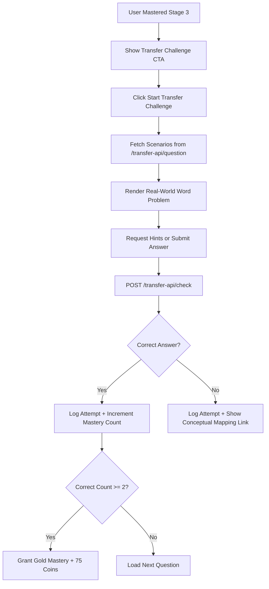

# Feature Walkthrough: Learning Transfer Challenges (Version 2)

This document provides a comprehensive walkthrough of the implementation, file changes, and testing procedures for the **Learning Transfer Challenges (Stage 4)** feature in Tenali. **Version 2** expands this feature dynamically to all learning modules in the platform using a generic dynamic generator fallback.

---

## 1. Feature Overview

The **Learning Transfer Challenges** feature provides a diagnostic layer that tests a student's conceptual understanding by asking them to apply mathematical procedures they have mastered in Stage 3 drills (percentages, ratios, fractions) to real-world, contextually diverse word problems (shopping, cricket, cooking, travel, etc.).

Successful completion of at least 2 transfer challenges triggers a **Gold Mastery Badge 🥇** and awards **+75 Sun Coins 🪙**.

---

## 2. Architecture & Implementation Details

The implementation is split across the Express backend and React frontend.



### Backend Implementation

1. **Scenario Generator (`server/transferScenarios.js`)**: 
   - Houses a modular set of real-world scenario builders grouped by topic key (`percent`, `ratio`, `fraction`).
   - Every scenario implements:
     - `generate()`: Produces randomized input variables, templates the contextual prompt, and defines up to three hints (Hint 1: Free conceptual guidance; Hint 2: Specific formula; Hint 3: Solved numerical example).
     - `evaluate(variables)`: Determines the correct answer.
     - `explanation(variables)`: Step-by-step math evaluation.
     - `transferMapping`: Explains the link between the abstract math concept and the real-world usage.
2. **API Routes (`server/index.js`)**:
   - `GET /transfer-api/question`: Picks a random transfer scenario for a specified topic, executes its variable generator, and serves it to the frontend.
   - `POST /transfer-api/check`: Evaluates the user's input, logs the attempt to the database (saving details such as seconds elapsed, hints clicked, and question prompt), increments the guest/authenticated user's correct counters, and returns the step-by-step solution.
3. **Database Logger (`server/auth.js`)**:
   - Integrates the Mongoose `StudentAttemptLog` schema to record detailed telemetry data (`studentId`, `topicKey`, `challengeType: 'transfer'`, `transferScenarioId`, `transferContext`, `hintsClickedCount`, `timeSpentSeconds`).

### Frontend Implementation

1. **Transfer Challenge View (`client/src/App.jsx`)**:
   - Implemented `TransferChallengeApp` to handle the interactive workflow.
   - Shows introductory screens explaining the rules and target awards.
   - Renders context tags (e.g., Cooking 🍕, Shopping 🛒) and progressive hint tabs.
   - Includes a unified text input field allowing user submissions and supports automated enter-key transitions.
   - Displays a celebratory screen with animated gold badges upon achieving Gold Mastery.
2. **Game Welcome Box Integration (`client/src/App.jsx`)**:
   - Added conditional Transfer CTAs within the home configurations of:
     - `PercentApp` (Percentages)
     - `RatioApp` (Ratio & Proportion)
     - `FractionAddApp` (Fraction Addition)
   - These check the user's `completedTopics` array and show the Stage 4 transfer button if the topic key is present.
3. **Vite API Proxies (`client/vite.config.js`)**:
   - Configured Vite proxy settings to pipe `/transfer-api/*` calls from the React app directly to the Express server running on port 4000.

---

## 3. Files Changed / Added

| Operation | File Path | Description |
| :--- | :--- | :--- |
| **[NEW]** | [server/transferScenarios.js](file:///c:/Users/varsh/My%20Projects/tenali/server/transferScenarios.js) | Core scenario definitions, templates, evaluation formulas, and hints. |
| **[MODIFY]** | [server/index.js](file:///c:/Users/varsh/My%20Projects/tenali/server/index.js) | Added `GET /transfer-api/question` and `POST /transfer-api/check` API routes. |
| **[MODIFY]** | [server/auth.js](file:///c:/Users/varsh/My%20Projects/tenali/server/auth.js) | Defined the Mongoose schema for persistent student attempt tracking. |
| **[MODIFY]** | [client/src/App.jsx](file:///c:/Users/varsh/My%20Projects/tenali/client/src/App.jsx) | Created the `TransferChallengeApp` component and integrated CTA buttons inside game screens. |
| **[MODIFY]** | [client/src/App.css](file:///c:/Users/varsh/My%20Projects/tenali/client/src/App.css) | Added design systems and CSS styling for the new transfer interface. |
| **[MODIFY]** | [client/vite.config.js](file:///c:/Users/varsh/My%20Projects/tenali/client/vite.config.js) | Configured local proxies to route `/transfer-api` traffic to the backend. |

---

## 4. How to Test the Feature

### Setup Local Servers
1. Start the backend Express server:
   ```powershell
   cd server
   npm install
   npm start
   ```
   *(Confirm output prints: `Tenali app running on http://0.0.0.0:4000`)*

2. Start the client Vite development server in a separate terminal:
   ```powershell
   cd client
   npm install
   npm run dev
   ```
   *(Open browser to: `http://localhost:5173/`)*

---

### Step-by-Step Testing Guide

#### Scenario A: Triggering Transfer Challenge (Natural Progression)
1. Select the **Percentages** game from the grid.
2. Complete a standard Stage 3 practice quiz (e.g. 5 or 10 questions) achieving a score of **80% or higher**.
3. Upon completion, return to the welcome page of Percentages.
4. You will see a newly unlocked **🚀 Start Transfer Challenge (Stage 4) 🥇** CTA block at the bottom of the welcome box.

#### Scenario B: Triggering Transfer Challenge (Developer Debug / Fast-Track)
1. Go to the dashboard home page.
2. Scroll to the very bottom and click the **🔄 Reset All Progress** button.
3. Click the **⚙️ Toggle Stage 3 Mastery** button. 
4. Type **`percent`** in the prompt box and click OK. The page reloads, and the Percentages game card displays a green checkmark (**✅**).
5. Click **⚙️ Toggle Stage 3 Mastery** again, type **`ratio`**, and click OK.
6. Click **⚙️ Toggle Stage 3 Mastery** again, type **`fractionadd`**, and click OK.
7. Open the **Percentages**, **Ratio & Proportion**, or **Fractions** game card. The **🚀 Start Transfer Challenge (Stage 4) 🥇** button will be visible instantly.

#### Scenario C: Verifying the Transfer Challenge Interface & Hint Mechanics
1. On the game welcome screen, click **🚀 Start Transfer Challenge (Stage 4) 🥇**.
2. Click **Start Challenge 🥇** inside the intro dialog.
3. Verify that the layout loads:
   - Displays a contextual icon and tag (e.g., Pizza 🍕, Travel 🚂) corresponding to the scenario.
   - Shows the word-problem prompt clearly.
   - Renders a **💡 Hint (Free)** button.
4. Click the **💡 Hint (Free)** button. Verify that a card pops up with conceptual instruction (Hint Level 1).
5. Observe the Hint button label shifts to **💡 Hint Level 2 (-10 coins)**. Click it to confirm it subtracts 10 coins and displays the corresponding math formula.

#### Scenario D: Verifying Solution Explanations & Mastery Completion
1. Enter an incorrect answer (or just type `1` or `xyz`) and hit **Submit Answer** or press `Enter`.
2. Verify that:
   - Feedback panel is highlighted in **red**.
   - Displays `❌ Let's review this:` followed by the correct numerical answer.
   - Shows the step-by-step solution path.
   - Shows a **Conceptual Link** explaining the real-world connection.
3. Click **Next Challenge**.
4. Solve the next question correctly. Once submitted, verify the success banner highlights in **green** with `✅ Well done!`.
5. Click **Next Challenge** (or **Complete Challenge**).
6. Complete the challenges. If you answered at least 2 questions correctly (this may require starting a second attempt if you missed the first), confirm that:
   - The **Gold Mastery Achieved! 🥇** banner is shown.
   - You are awarded **+75 Sun Coins**.
   - The **Results Table** summarizes your prompt, userAnswer, correctAnswer, correctness status, and seconds spent.
7. Click **Back to Dashboard** and verify the game card now displays a **🥇** badge.

---

### 3. Version 2: Dynamic Fallback Walkthrough & Testing

Version 2 automatically extends Stage 4 Transfer Challenges to **every single quiz module** on the dashboard. If no dedicated scenario templates are written for a topic, the server generates one on the fly.

#### Verification of Version 2:
1. Complete a Stage 3 Practice for a non-curated topic (e.g., **Addition** or **Trigonometry**).
   - Alternatively, scroll to the bottom of the home dashboard and use **⚙️ Toggle Stage 3 Mastery** to type `addition` (for the Addition game).
2. The dashboard card for **Addition** will display a checkmark (**✅**).
3. Open the card to view the welcome box. The **🚀 Start Transfer Challenge (Stage 4) 🥇** button will be visible!
4. Click the button to start. 
5. Verify that:
   - The challenge loads a dynamic, real-world context prompt (e.g., "Arjun is shopping...", "Priya is adjusting spice levels...").
   - The embedded math question in the story is a randomized addition problem generated by the backend's standard addition quiz generator.
6. Verify checking mechanics:
   - Inputting a correct answer correctly routes the request to `/addition-api/check` internally, returning correct feedback.
   - Inputting an incorrect answer validates correctly and shows the correct answer display along with the solution explanation.
7. Completing 2 challenges successfully awards the Gold Mastery badge (**🥇**) and **+75 coins**, which persists across reloads!
